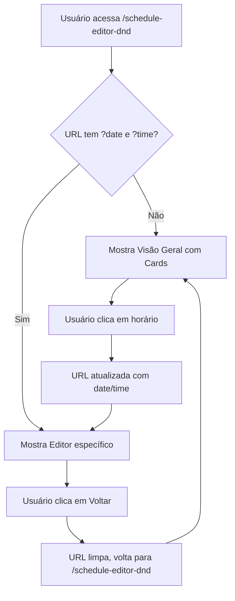

# 📅 Interface de Seleção de Horário de Missa

## 🎯 Localização

**Página:** Editor de Escalas (Drag & Drop)
**URL:** `/schedule-editor-dnd`
**Arquivo:** `/client/src/pages/ScheduleEditorDnD.tsx`

## ✨ Como Funciona

### 1. Visão Geral (Tela Inicial)

Quando você acessa o Editor de Escalas **sem** selecionar uma data/horário específico, você verá:

```
┌─────────────────────────────────────────────────────────┐
│ Editor de Escalas (Drag & Drop)                        │
│ outubro 2025                     [Exportar] [Recarregar]│
├─────────────────────────────────────────────────────────┤
│ 💡 Selecione uma data para editar:                     │
│    Clique em uma das datas abaixo para editar...       │
├─────────────────────────────────────────────────────────┤
│                                                         │
│ ┌──────────┐  ┌──────────┐  ┌──────────┐  ┌──────────┐│
│ │ Domingo  │  │ Domingo  │  │ Domingo  │  │ Domingo  ││
│ │ 6 de out │  │ 13 de out│  │ 20 de out│  │ 27 de out││
│ │          │  │          │  │          │  │          ││
│ │ 08:00    │  │ 08:00    │  │ 08:00    │  │ 08:00    ││
│ │ 12/15    │  │ 8/15     │  │ 15/15    │  │ 0/15     ││
│ │ [Parcial]│  │ [Parcial]│  │[Completa]│  │ [Vazia]  ││
│ │          │  │          │  │          │  │          ││
│ │ 10:00    │  │ 10:00    │  │ 10:00    │  │ 10:00    ││
│ │ 14/15    │  │ 10/15    │  │ 15/15    │  │ 5/15     ││
│ │ [Parcial]│  │ [Parcial]│  │[Completa]│  │ [Parcial]││
│ │          │  │          │  │          │  │          ││
│ │ 19:00    │  │ 19:00    │  │ 19:00    │  │ 19:00    ││
│ │ 15/15    │  │ 12/15    │  │ 14/15    │  │ 8/15     ││
│ │[Completa]│  │ [Parcial]│  │ [Parcial]│  │ [Parcial]││
│ └──────────┘  └──────────┘  └──────────┘  └──────────┘│
└─────────────────────────────────────────────────────────┘
```

### 2. Interface de Cards

Cada **card** representa um dia do mês com missas:

**Componentes do Card:**
```
┌────────────────────────────┐
│ 📅 Domingo                │  ← Dia da semana
│ 6 de outubro              │  ← Data
├────────────────────────────┤
│ ┌────────────────────────┐ │
│ │ 08:00                  │ │  ← Horário da missa
│ │ 12 / 15 ministros      │ │  ← Progresso (X de Y)
│ │         [Parcial]      │ │  ← Status (badge colorido)
│ └────────────────────────┘ │
│ ┌────────────────────────┐ │
│ │ 10:00                  │ │
│ │ 15 / 15 ministros      │ │
│ │        [Completa]      │ │  ← Verde quando completa
│ └────────────────────────┘ │
│ ┌────────────────────────┐ │
│ │ 19:00                  │ │
│ │ 0 / 15 ministros       │ │
│ │          [Vazia]       │ │  ← Vermelho quando vazia
│ └────────────────────────┘ │
└────────────────────────────┘
```

### 3. Status dos Horários

**Cores dos Badges:**

| Status | Cor | Quando Aparece |
|--------|-----|----------------|
| **Vazia** | 🔴 Vermelho (destructive) | 0 ministros escalados |
| **Parcial** | 🟡 Cinza (secondary) | Entre 1 e (max-1) ministros |
| **Completa** | 🟢 Verde (default) | Número máximo de ministros |

### 4. Clicando em um Horário

Quando você clica em um botão de horário (ex: "08:00"), acontece:

1. **URL muda** para: `/schedule-editor-dnd?date=2025-10-06&time=08:00:00`
2. **Tela muda** para o editor drag & drop **apenas daquele horário**
3. **Aparece botão "Voltar"** no topo para retornar à visão geral

**Tela de Edição:**
```
┌─────────────────────────────────────────────────────────┐
│ ← Voltar para Visão Geral                              │
├─────────────────────────────────────────────────────────┤
│ Editando: 6 de outubro às 08:00                        │
│ Status: Publicada                     [Recarregar]      │
│                                        [Salvar Tudo]    │
├─────────────────────────────────────────────────────────┤
│ 💡 Como usar o editor drag & drop:                     │
│    • Arraste ministros para reordenar...               │
│    • Arraste entre colunas para mover...               │
├─────────────────────────────────────────────────────────┤
│                                                         │
│ [Grid de ministros drag & drop - APENAS 08:00]        │
│                                                         │
└─────────────────────────────────────────────────────────┘
```

## 🔄 Fluxo Completo



## 🎨 Layout Responsivo

**Desktop (XL - 4 colunas):**
```
[Card] [Card] [Card] [Card]
[Card] [Card] [Card] [Card]
```

**Tablet (LG - 3 colunas):**
```
[Card] [Card] [Card]
[Card] [Card] [Card]
```

**Tablet Pequeno (MD - 2 colunas):**
```
[Card] [Card]
[Card] [Card]
```

**Mobile (< MD - 1 coluna):**
```
[Card]
[Card]
[Card]
```

## 🛠️ Implementação Técnica

### Funções Principais

**1. handleSelectMassTime(date, time)**
```typescript
const handleSelectMassTime = (date: Date, time: string) => {
  setSelectedDate(date);
  setSelectedTime(time);
  const dateStr = format(date, 'yyyy-MM-dd');
  setLocation(`/schedule-editor-dnd?date=${dateStr}&time=${time}`);
};
```

**2. handleBackToSelector()**
```typescript
const handleBackToSelector = () => {
  setSelectedDate(null);
  setSelectedTime(null);
  setLocation('/schedule-editor-dnd');
};
```

**3. slotsByDate (agrupamento)**
```typescript
const slotsByDate = slots.reduce((acc, slot) => {
  if (!acc[slot.date]) {
    acc[slot.date] = [];
  }
  acc[slot.date].push(slot);
  return acc;
}, {} as Record<string, MassTimeSlot[]>);
```

### Renderização Condicional

```typescript
{/* Visão Geral - Seletor de Cards */}
{!selectedDate && !selectedTime && slots.length > 0 && (
  <div className="grid gap-4 md:grid-cols-2 lg:grid-cols-3 xl:grid-cols-4">
    {/* Cards de seleção */}
  </div>
)}

{/* Editor Drag & Drop - Quando selecionado */}
{selectedDate && selectedTime && slots.length > 0 && (
  <DraggableScheduleEditor ... />
)}
```

## 📋 Checklist de Verificação

Para confirmar que está funcionando:

- [ ] Acesse `/schedule-editor-dnd` sem parâmetros na URL
- [ ] Você vê cards com datas do mês agrupadas
- [ ] Cada card mostra os horários de missa do dia
- [ ] Badges coloridos mostram status (Vazia/Parcial/Completa)
- [ ] Ao clicar em um horário, URL muda para incluir `?date=...&time=...`
- [ ] Editor drag & drop aparece com apenas aquele horário
- [ ] Botão "← Voltar para Visão Geral" aparece no topo
- [ ] Ao clicar em Voltar, retorna para os cards
- [ ] Botão "Exportar Escalas" **só aparece** na visão geral (não quando editando)

## 🎯 Vantagens da Nova Interface

### Antes:
❌ Todos os horários misturados na mesma tela
❌ Difícil de encontrar um horário específico
❌ Muito scroll para ver tudo
❌ Confuso com múltiplas missas

### Agora:
✅ Visão clara de todas as datas do mês
✅ Status visual de cada horário (vazia/parcial/completa)
✅ Edição focada em um horário por vez
✅ Navegação intuitiva com botão Voltar
✅ Menos scroll, mais organizado

## 🔍 Troubleshooting

### Cards não aparecem

**Possível causa:** Não há escala criada para o mês
**Solução:** Gere uma escala primeiro em "Gerar Escalas"

### Cards aparecem vazios

**Possível causa:** Escala existe mas sem assignments
**Solução:** Normal se é uma escala nova. Clique em um horário para começar a adicionar ministros.

### Botão não responde ao clique

**Possível causa:** JavaScript não carregou
**Solução:** Abra DevTools (F12) e procure erros no console

### URL não atualiza ao clicar

**Possível causa:** Wouter router não inicializado
**Solução:** Verifique se há erros de compilação. Recompile com `npm run build`

## 📍 Arquivos Modificados

**Arquivo:** `/client/src/pages/ScheduleEditorDnD.tsx`

**Linhas Modificadas:**
- **406-427**: Funções `handleBackToSelector` e `handleSelectMassTime`
- **420-427**: Agrupamento `slotsByDate`
- **544-655**: Interface de seleção com cards e renderização condicional

**Dependências:**
- `date-fns`: Formatação de datas
- `wouter`: Navegação e URL params
- `lucide-react`: Ícones (Calendar)
- `shadcn/ui`: Cards, Buttons, Badges

---

**Última atualização:** 06/10/2025
**Versão:** 2.0.0 (com interface de seleção)
